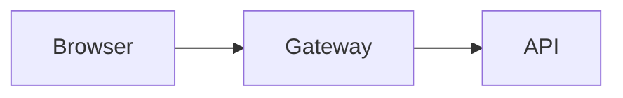

# Plannotator Visual Explainer

## Route by content type

**Implementation plan, design doc, or proposal** → Follow the [Plan path](#plan-path). Uses directives for structure. No HTML references needed.

**PR explainer, diff review, or code change walkthrough** → Follow the [PR path](#pr-path). Read `references/pr-components.md` for Pierre diff rendering. Directives for summary sections; HTML for diff hunks.

**Everything else** (data tables, slide decks, project recaps, general visual explanations) → Follow the [Visual explainer path](#visual-explainer-path). Delegates to nicobailon/visual-explainer with Plannotator theme tokens.

**HTML escape hatch** → Only when directives don't cover the layout (custom SVG positioning, UI mockups, bespoke grids). Read `references/design-system.md` + `references/svg-patterns.md` at that point, not before.

## Delivery

Always deliver via Plannotator's annotation UI. Do NOT use `open` or `xdg-open`.

**Markdown with directives** (default):
```bash
plannotator annotate <file.md>
```

**Plans/proposals with gate** (user should approve/deny):
```bash
plannotator annotate <file.md> --gate
```

**HTML escape hatch** (only when directives don't suffice):
```bash
plannotator annotate <file> --render-html
```

---

## Directive path

Rich directives render structured visual components directly in markdown — no HTML, no CSS tokens, no iframe. They inherit the active Plannotator theme automatically.

Available directives:

**`:::stats`** — Summary strip of stat cards
```
:::stats
4 | MRs
2 | Approved | success
2 | Blocked | destructive
:::
```
Each line: `value | label` or `value | label | color`. Colors: `success`, `destructive`, `warning`, `primary`.

**`:::milestone [status]`** — Timeline entry
```
:::milestone done
### Deploy to staging
All checks green.
`backend-api`
:::
```
Status on opening line: `done` (green), `warn` (yellow), `blocked` (red), or omitted (default). `###` heading = title. Backtick-only lines = tag chips. Consecutive milestones render as a connected vertical timeline.

**`:::risks`** — Risk grid with severity badges
```
:::risks
HIGH | Merge conflicts | Rebase before merging
MED | Stale pipeline | Retrigger CI
LOW | Reviewer OOO | Not blocking
:::
```
Each line: `severity | name | mitigation`. HIGH/MED/LOW map to badge colors.

**`:::cols`** — Multi-column layout
```
:::cols
:::col
Left column content.
:::col
Right column content.
:::
```
N columns auto-detected from `:::col` count. Use `:::cols 3` for explicit count. Collapses to single column on narrow viewports.

**`:::diagram [caption]`** — Diagram panel
````
:::diagram Request flow through the gateway

:::
````
Wraps code fences (mermaid, graphviz) or inline `<svg>` in a bordered, captioned panel. Inline SVG inherits theme CSS variables — use `var(--primary)` etc. instead of hardcoded colors.

---

## Plan path

For implementation plans, design docs, feature specs, migration guides, and proposals. Uses directives — no HTML references to read.

**Document structure (in order, pick what fits):**

1. **Header** — `#` title, then a `>` blockquote with the original brief
2. **Summary strip** — `:::stats` with 3-5 key numbers at a glance
3. **Milestones / timeline** — consecutive `:::milestone` blocks showing phases. No time estimates — phases show sequence and dependencies, not duration.
4. **Architecture / data flow** — `:::diagram` wrapping mermaid or inline SVG. Use for 3+ interacting components.
5. **Side-by-side comparison** — `:::cols` for before/after, option A vs B, or any two-pane layout
6. **Key code** — fenced code blocks. Only architecturally significant interfaces/schemas.
7. **Risks & mitigations** — `:::risks` with severity and mitigation per row
8. **Open questions** — `:::note` or `:::warning` callouts with decision owner

Not every plan needs every section. Skip what doesn't serve the content. Never include time estimates, boilerplate sections, or exhaustive file lists.

**Adapt to the task:** Backend → lead with data flow diagram. Frontend → lead with columns (mockup vs spec). Refactoring → lead with before/after columns. Infrastructure → lead with architecture diagram.

**Quality bar:** The plan answers "what, why, and how" within 30 seconds of reading. Whitespace is a feature — one idea per viewport.

---

## PR path

For PR walkthroughs, diff reviews, code change explainers, and reviewer guides.

**Before generating, read:** `references/pr-components.md` — Pierre diff CDN, file cards, before/after panels. Use directives for summary sections (stats, risks, cols); HTML only for diff hunks that need Pierre syntax highlighting.

**Document structure (in order, pick what fits):**

1. **Header** — PR title, `:::stats` meta strip (file count, +/- lines)
2. **TL;DR** — `:::note` callout. 2-3 sentences.
3. **Why** — `:::cols` with before/after comparison
4. **File tour** — HTML file cards with Pierre diffs (this is the HTML escape hatch — directives can't render syntax-highlighted diffs)
5. **Risk map** — `:::risks` showing which files need careful review
6. **Where to focus** — numbered `:::warning` callouts per concern
7. **Test plan** — checkbox task list (`- [ ]`)

---

## Visual explainer path

For architecture diagrams, data tables, slide decks, project recaps, comparisons, and any other visual explanation.

**Before generating:**

1. Ensure `visual-explainer` is installed:
   - Check: `~/.claude/skills/visual-explainer/SKILL.md` or `~/.agents/skills/visual-explainer/SKILL.md`
   - If not found: `npx skills add nicobailon/visual-explainer -g --yes`
2. Read visual-explainer's `SKILL.md` (workflow, diagram types, anti-slop rules)
3. Read the relevant visual-explainer references and templates for your content type
4. Read `references/theme-override.md` — Plannotator tokens replacing Nico's palettes

Follow visual-explainer's structure, component classes (`.ve-card`, `.kpi-card`, `.pipeline`), and anti-slop rules. The only override is the color/typography layer — Plannotator tokens instead of Nico's custom palettes.

---

## Design philosophy (all paths)

- **Whitespace is a feature.** Generous padding, large section gaps. If cramped, add space — don't shrink text.
- **One idea per viewport.** Hero section, then diagram, then detail grid — not all crammed together.
- **Show, don't describe.** A timeline shows sequencing. A diagram shows relationships. A code block shows the interface.
- **No time estimates.** Timelines show phases and dependencies. Never attach hour/day estimates.
