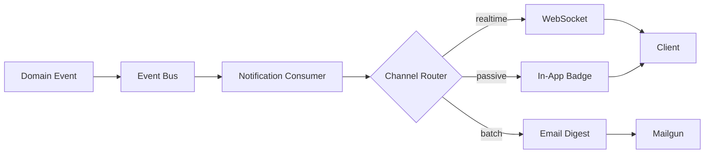

# Implementation Plan: User Notification Service

> **Brief:** Add a notification service that delivers real-time alerts to users via WebSocket, email digest, and in-app badge. Must integrate with the existing event bus and respect per-user quiet hours.

---

:::stats
3 | New Services | primary
5 | Files Changed | warning
2 | API Endpoints
1 | DB Migration | destructive
12 | Tests Added | success
:::

---

## Milestones

:::milestone done
### Database schema & migration
Add `notifications` and `user_preferences` tables. Online DDL with zero-downtime migration.
`packages/db/migrations`
`packages/db/schema.ts`
:::

:::milestone done
### Event bus consumer
Subscribe to domain events, transform into notification payloads, fan out to delivery channels.
`packages/server/consumers`
`packages/shared/events.ts`
:::

:::milestone warn
### WebSocket delivery channel
Persistent connections per user session. Reconnect with exponential backoff. Heartbeat every 30s.
`packages/server/ws`
`packages/client/hooks/useNotifications.ts`
:::

:::milestone blocked
### Email digest aggregation
Batch notifications into hourly/daily digests. Respect quiet hours. Requires email provider API key.
`packages/server/digests`
:::

:::milestone
### In-app badge & notification center
Badge count in nav bar. Dropdown panel with mark-as-read, dismiss, and bulk actions.
`packages/client/components/NotificationBadge.tsx`
`packages/client/components/NotificationPanel.tsx`
:::

---

## Architecture

:::diagram Notification delivery pipeline

:::

---

## Key Interface

```typescript
interface NotificationPayload {
  userId: string;
  type: 'mention' | 'review' | 'deploy' | 'alert';
  title: string;
  body: string;
  channel: ('ws' | 'email' | 'badge')[];
  priority: 'low' | 'normal' | 'urgent';
  metadata?: Record<string, unknown>;
}
```

---

## Comparison

:::cols
:::col
#### Current State
Events fire into the void. Users poll dashboards manually. No notification preferences. Email is all-or-nothing — users either get every event or unsubscribe entirely.

- No real-time delivery
- No per-user preferences
- No quiet hours
- ~2min latency via polling
:::col
#### After This Change
Real-time WebSocket push with < 200ms latency. Per-user channel preferences and quiet hours. Smart batching for email to reduce noise. Badge count for passive awareness.

- Sub-200ms WebSocket delivery
- Granular channel preferences
- Quiet hours respected
- Hourly/daily email digests
:::

---

## Risk Assessment

:::risks
HIGH | Database migration on large users table | Run during off-peak window with online DDL — no locks
HIGH | WebSocket connection storms at deploy | Staggered reconnect with jittered backoff (2-30s range)
MED | Email provider rate limits | Queue with exponential retry, circuit breaker at 80% quota
MED | Quiet hours timezone edge cases | Store preferences in UTC, convert at delivery time
LOW | Badge count drift on network partition | Reconcile on next successful WebSocket heartbeat
LOW | Digest email formatting across clients | Use MJML templates, test with Litmus
:::

---

## Open Questions

:::warning
**Should WebSocket connections be per-tab or per-user?** Per-tab is simpler but wastes server resources for users with 10+ tabs. Per-user with SharedWorker saves connections but adds browser compat complexity.
Decide with: infrastructure team
:::

:::note
**Email provider choice:** Mailgun vs SendGrid vs SES. Mailgun is cheapest at our volume (< 50k/month). SendGrid has better templates. SES needs more operational overhead.
Decide with: platform lead
:::

:::tip
**Quick win:** The in-app badge can ship independently before WebSocket and email channels are ready. It only needs the DB schema and a polling endpoint — no event bus dependency.
:::

---

## Verification

- [ ] Migration runs in < 30s on staging (5M rows)
- [ ] WebSocket reconnects within 5s after network drop
- [ ] Quiet hours block delivery between configured times
- [ ] Email digest batches correctly across timezone boundaries
- [ ] Badge count matches unread notification count after page refresh
- [ ] Load test: 1000 concurrent WebSocket connections, < 200ms p95 delivery
