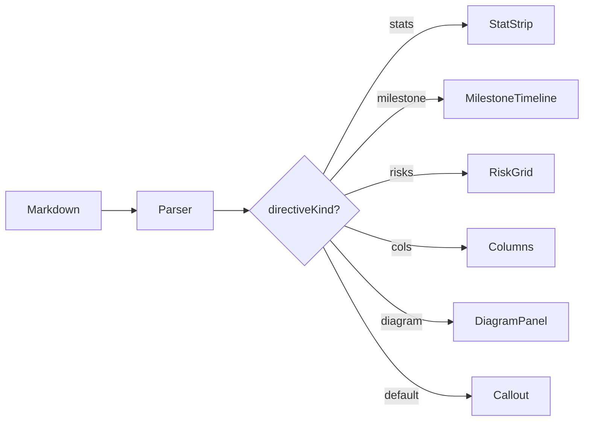

# Rich Directives Demo

A showcase of the 5 new directive kinds.

---

## Stats Strip

:::stats
5 | Components
3 | New Files | success
2 | Modified | warning
1 | Breaking | destructive
:::

---

## Milestone Timeline

:::milestone done
### Parser regex update
Extended directive regex to capture trailing args. Added `directiveArgs` to Block type. All tests pass.
`parser.ts`
`types.ts`
:::

:::milestone done
### Component implementation
Built StatStrip, MilestoneTimeline, RiskGrid, Columns, and DiagramPanel. Theme CSS added.
`BlockRenderer.tsx`
`theme.css`
:::

:::milestone warn
### Skill updates
Visual-explainer and setup-goal skills updated with directive syntax. PR path still uses HTML for Pierre diffs.
`SKILL.md`
:::

:::milestone blocked
### Upstream merge
PR submitted. Waiting on maintainer review.
`backnotprop/plannotator#835`
:::

---

## Risk Grid

:::risks
HIGH | Breaking change to parser regex | Backwards compatible — existing directives still route to Callout
MED | SVG sanitization bypass | Uses same DOMPurify path as HtmlBlock
LOW | Theme token mismatch | Components use Tailwind bridge, no hardcoded colors
:::

---

## Multi-Column Layout

:::cols
:::col
#### Before (HTML)

Agents wrote 20-30KB of raw HTML with:
- ~100 lines of `:root` CSS tokens
- ~200 lines of component CSS
- Inline SVG with hardcoded colors
- Delivery via `--render-html` iframe
:::col
#### After (Directives)

Agents write 3KB of structured markdown:
- Zero CSS — theme inherited
- Native annotation precision
- `plannotator annotate file.md`
- Full theme switching support
:::

---

## Diagram Panel

:::diagram Architecture: directive rendering pipeline

:::

---

## Combined Example

A typical plan section mixing directives with standard markdown:

:::stats
4 | MRs Open
2 | Approved | success
2 | Blocked | destructive
5 | Jira Subtasks
:::

> [!NOTE]
> All MR approvals are from human reviewers. Bot threads (CodeRabbit) are informational only.

:::cols
:::col
#### Ready to merge
- !64 evo-action-center (1/1 approved)
- !246 evo-conversions (2/2 approved, bot threads only)
:::col
#### Needs work
- !381 fusion-lms (conflicts, squash fix)
- !143 gtm-recommendations (blocked by UX decision)
:::

:::risks
HIGH | !381 has merge conflicts with main | Rebase before re-requesting review
MED | !246 has 12 unresolved CodeRabbit threads | Resolve or dismiss — they block merge
LOW | dlynn OOO until Jun 13 | Already approved !246, not blocking
:::
