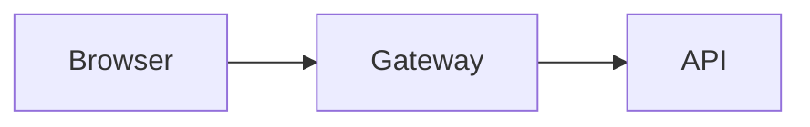

# Rich Directive Components for Plannotator

## Brief

Agents generating plans, explainers, and PR walkthroughs through Plannotator currently write 20-30KB of raw HTML with copy-pasted CSS tokens because the markdown renderer lacks structured visual components. The directive system (`:::kind ... :::`) already parses arbitrary kinds but only renders a generic `<Callout>` for all of them. This proposal extends the directive system with purpose-built React components — stat strips, milestone timelines, risk grids, multi-column layouts, and diagram panels — so agents write concise markdown instead of verbose, inconsistent HTML.

## Problem

The `plannotator-visual-explainer` skill instructs agents to generate self-contained HTML files with:
- ~100 lines of `:root` CSS token declarations (copied verbatim every time)
- ~200 lines of component CSS (stat cards, milestones, risk grids, badges, etc.)
- Custom SVG diagrams with inline styles referencing those tokens
- Delivery via `--render-html` iframe path (loses native annotation precision)

This causes:
1. **Token drift** — agents regenerate CSS from memory, introducing inconsistencies between documents
2. **Bloated output** — 30KB HTML for what could be 3KB of structured markdown
3. **Annotation degradation** — HTML viewer uses iframe + bridge; markdown viewer has native text selection
4. **Theme disconnection** — standalone HTML hardcodes light-theme tokens; only inherits runtime theme through iframe injection

## Solution: extend `:::directive` kinds

The parser already handles `:::kind ... :::` → `Block { type: 'directive', directiveKind: kind }`. Currently `BlockRenderer` routes all directive kinds to a generic `<Callout>`. The change: add new `directiveKind` → component mappings for structured visual blocks.

### New directive kinds

#### `:::stats` — Summary strip

```
:::stats
4 | MRs
2 | Approved | success
2 | Blocked | destructive
5 | Jira Subtasks
:::
```

Each line: `value | label` or `value | label | color`. Color is a semantic token name (`success`, `destructive`, `warning`, `primary`). Renders as a responsive grid of stat cards matching the design-system.md `summary-strip` pattern.

#### `:::milestone [status]` — Timeline entry

```
:::milestone done
### Deploy to staging
All checks green.
`backend-api`
:::

:::milestone blocked
### Rebase feature branch
Conflicts with main.
`data-service`
:::
```

Status: `done` (green dot), `warn` (yellow), `blocked` (red), or omitted (default purple outline). Status lives on the opening line — same pattern as `:::note`. First `###` heading becomes the title. Body is prose (rendered with `InlineMarkdown`). Backtick-only lines become tag chips. Consecutive `:::milestone` blocks render as a connected vertical timeline.

#### `:::risks` — Risk grid

```
:::risks
HIGH | Merge conflicts on main | Rebase before merging
MED | Stale pipeline | Retrigger CI
LOW | Reviewer OOO | Not a hard blocker
:::
```

Each line: `severity | name | mitigation`. Severity maps to badge color (`HIGH` → destructive, `MED` → warning, `LOW` → success). Renders as the design-system.md risk-grid pattern.

#### `:::cols [N]` — Multi-column layout

```
:::cols
:::col
#### Left column
Content here.
:::
:::col
#### Right column
More content.
:::
:::
```

Nesting support: `:::cols` contains N `:::col` children (default 2, auto-detected from child count). Each column renders its body with full block rendering (headings, lists, code, inline markdown). Responsive: collapses to single column below 720px. For explicit column count: `:::cols 3`.

#### `:::diagram [caption]` — Diagram panel

````
:::diagram Request flow through the API gateway

:::
````

Wraps a code fence (mermaid, graphviz) or inline `<svg>` in a bordered panel with an optional caption. Inline SVG is sanitized through the same DOMPurify path as `HtmlBlock` and inherits theme tokens from CSS variables — no hardcoded colors needed. The design-system.md `diagram-panel` pattern.

### Inline extensions (future, not in this PR)

- `[badge:ok]Approved` → green badge chip
- `[tag:highlight]evo-conversions` → highlighted tag chip

These require `InlineMarkdown` tokenizer changes and are out of scope for this PR.

## Implementation

### Files to change

| File | Change | LOC |
|---|---|---|
| `packages/ui/components/blocks/StatStrip.tsx` | New component | ~60 |
| `packages/ui/components/blocks/MilestoneTimeline.tsx` | New component | ~80 |
| `packages/ui/components/blocks/RiskGrid.tsx` | New component | ~70 |
| `packages/ui/components/blocks/TwoCol.tsx` | New component + nested block rendering | ~50 |
| `packages/ui/components/blocks/DiagramPanel.tsx` | New component wrapping existing mermaid/graphviz + sanitized SVG | ~50 |
| `packages/ui/components/BlockRenderer.tsx` | New `directiveKind` cases in switch | ~25 |
| `packages/ui/theme.css` | Directive-specific CSS classes | ~80 |
| `packages/shared/pfm-reminder.ts` | Document new directive kinds | ~30 |
| `packages/ui/utils/parser.ts` | No changes needed | 0 |
| `packages/ui/utils/parser.test.ts` | Tests for directive body parsing | ~60 |
| `apps/skills/plannotator-visual-explainer/SKILL.md` | Add directive path + update delivery | ~30 |
| `apps/skills/plannotator-visual-explainer/references/design-system.md` | Directive syntax examples | ~60 |
| `apps/skills/plannotator-visual-explainer/references/theme-override.md` | Directive theme inheritance note | ~10 |
| `apps/skills/plannotator-visual-explainer/references/svg-patterns.md` | `:::diagram` SVG embedding note | ~10 |
| **Total** | | **~615** |

### Parser: zero changes

The existing directive parser already captures arbitrary `:::kind` with the regex `/^:::\s*([a-zA-Z][a-zA-Z0-9-]*)\s*$/`. Content between `:::kind` and closing `:::` is stored raw in `block.content`. Each new component parses its own body format.

### BlockRenderer dispatch

```tsx
case 'directive': {
  const kind = block.directiveKind || 'note';
  switch (kind) {
    case 'stats':
      return <StatStrip blockId={block.id} body={block.content} />;
    case 'milestone':
      return <MilestoneTimeline blockId={block.id} body={block.content} status={...} />;
    case 'risks':
      return <RiskGrid blockId={block.id} body={block.content} />;
    case 'cols':
      return <TwoCol blockId={block.id} body={block.content} />;
    case 'diagram':
      return <DiagramPanel blockId={block.id} body={block.content} caption={...} />;
    default:
      return <Callout ... />;  // existing behavior preserved
  }
}
```

### Theme integration

Components use Tailwind classes that resolve through the existing CSS variable bridge:

```css
/* theme.css additions */
.directive-stats { /* grid layout */ }
.directive-milestone .dot--done { background: var(--success); }
.directive-milestone .dot--blocked { background: var(--destructive); }
.directive-risks .badge--high { color: var(--destructive); }
```

No `:root` token declarations in components. Theme tokens flow from the existing `theme-{name}` class on `<html>`.

### Annotation compatibility

Each component renders with `data-block-id={block.id}` and `data-block-type="directive"`. The existing web-highlighter selection works on any rendered text. No annotation model changes needed.

### Backward compatibility

All existing `:::note`, `:::tip`, `:::warning`, `:::caution`, `:::important` directives continue routing to `<Callout>` via the `default` case. No breaking changes.

## Skill updates (in this repo)

The `plannotator-visual-explainer` skill and its references ship with plannotator at `apps/skills/plannotator-visual-explainer/`. The installer deploys them to `~/.agents/skills/`. These updates are part of the same PR:

| File | Change |
|---|---|
| `apps/skills/plannotator-visual-explainer/SKILL.md` | Add directive path: "For structured layouts, use rich directives instead of raw HTML." Update delivery to `plannotator annotate <file.md>` (no `--render-html`). Keep HTML path only for custom SVG architecture diagrams. |
| `apps/skills/plannotator-visual-explainer/references/design-system.md` | Add directive syntax examples alongside existing HTML/CSS component patterns. Show both formats so agents can choose. |
| `apps/skills/plannotator-visual-explainer/references/theme-override.md` | Note that directives inherit theme natively — no token copy needed. The override doc becomes relevant only for the HTML escape hatch. |
| `apps/skills/plannotator-visual-explainer/references/svg-patterns.md` | Add note that SVG can be embedded inside `:::diagram` directives, inheriting theme tokens from CSS vars. |

## Open questions

:::callout
### Should `:::diagram` support inline SVG directly?
Yes — included in this PR. Inline `<svg>` inside `:::diagram` is sanitized via DOMPurify (same path as `HtmlBlock`) and inherits theme tokens from CSS variables. This lets agents write SVG architecture diagrams with `var(--primary)` etc. without the `--render-html` iframe path.
:::

## Prior art

- **GitHub Alerts** (`> [!NOTE]`) — Plannotator already supports these as `alertKind` blocks
- **Docusaurus admonitions** (`:::tip`) — same directive syntax, richer component set
- **Starlight** (Astro) — `:::note[Custom Title]` with title in brackets
- **Obsidian callouts** (`> [!info]`) — metadata-driven block styling
- **remark-directive** — the unified plugin that standardized `:::` syntax

The `:::kind` syntax is widely adopted. Extending it with structured kinds follows the same pattern as all of the above.

## Contribution process

1. **Open a GitHub issue** on `backnotprop/plannotator` describing the feature with a link to the PR
2. **Fork → branch → implement → PR** per CONTRIBUTING.md (dual MIT/Apache-2.0 license)
3. PR targets `main`, includes the components + theme CSS + pfm-reminder update + tests
4. Maintain the fork regardless — the implementation is immediately useful on our machines before upstream merge
5. After upstream merge (if accepted): update operator-owned skills in dotfiles
